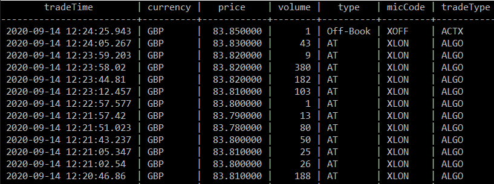
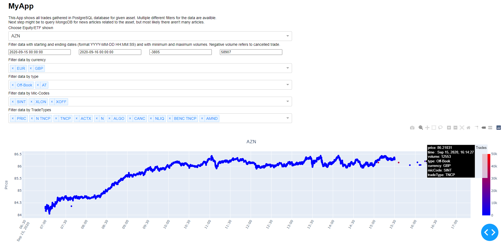

This repo fetches trade data from London Stock Exchange API and saves the data into PostgreSQL database. The repo also fetches news articles from Reuters, MarketWatch and Financial Times sitemap.xml files and saves them into MongoDB database. Trade data is then visualized as an interactive dashboard. MongoDB data will be visualized later (maybe). Code is implemented as Python.

### Prerequisite

Install MongoDB and PostgreSQL. Create a PostgreSQL and MongoDB databases.<br>
Install requirements.txt packages.

Create a "config" folder and a "database_config.json" file in it. This file has all the configurations needed to connect to the databases. It is currently as:<br>
```json
{
    "MongoDB":{"URI":"some_value","dbName":"some_value"},
    "PostgreSQL":{"dbName":"some_value","username":"some_value","password":"some_value","host":"some_value","port":"some_value"}
}
```

### File Descriptions

**app folder**
- Has one file and one folder
    - visualize.py
        - Uses postgre/postgre_connection.py and config/database_config.json to connect to PostgreSQL.
        - Creates interactive visualization of trades of given asset with multiple available filters.
        - TODO: Connect to MongoDB and visualize also news articles related to the asset. Or create some other visualization using Mongo articles.
    - assets folder
        - Has typography.css file that has some styling for the visualize.py app.

Scripts in this folder are run by "python visualize.py"
(Note that you need to have PostgreSQL database with data in it to be able to visualize anything)

**assets folder**
- Has images for readme.md

**postgre folder**
- This folder has three files:
    - postgre_connection.py
        - Connects to postgresql database with credentials given in config/database_config.json
    - london_stocks.txt
        - Names of all stocks that one wants to fetch from London Stock Exchange.
    - london_stock_data.py
        - Uses postgre_connection.py to connect to the database.
        - Fetches trades done in current day for all stocks in london_stocks.txt file from London Stock Exchange API. If a stock does not have its own table in the database then the script creates one. Adds only newer data than those that already exist in the table. Sleeps 6-10 secs between the API calls.

Scripts in this folder are run by "python london_stock_data.py"

**mongo folder**
- This folder has four files:
    - mongodb_connection.py
        - Connects to MongoDB database with credentials given in config/database_config.json
    - sitemaps.txt
        - Has URLS of all sitemaps one wants to fetch.
    - news_sitemap.py
        - Fetches one sitemap.xml file and parses information of title, link, tickers and publication time.
        - Uses mongodb_connection.py to check if the article already exists in a collection, if not then adds it to the collection. If collection does not exist, then it is created.
    - controller.py
        - Uses mongodb_connection.py to create a db connection.
        - Uses sitemaps.txt to get list of all sitemaps to request.
        - Loops through the sitemaps. In each loop passes the connection to db into news_sitemap.py and gets data from each sitemap.xml

Scripts in this folder are run by "python controller.py"

Example image of data in MongoDB


Example image of data in PostgreSQL



Example image of the App

